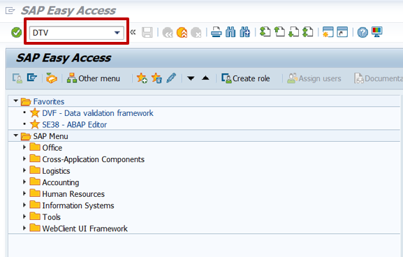
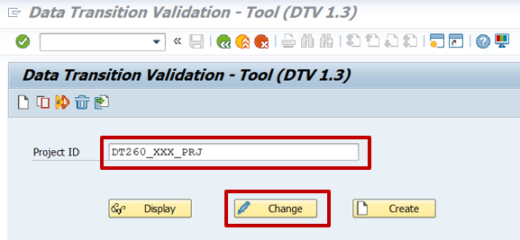
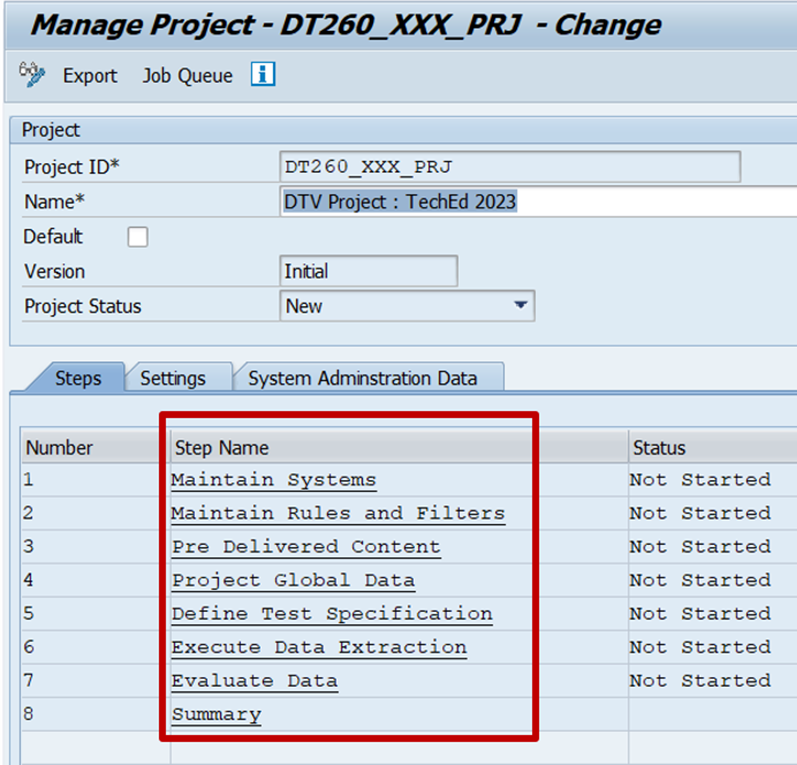

# Exercise 2 - Exercise 2 Description

In this exercise, we will create...

## Exercise 2.1 User and project setup

After completing these steps you will have logged in to the ABAP system with authorized user.

### Exercise 2.1.1 User setup
You have been assigned a user with needed authorization to execute DTV tool. Using the user provided, enter the system. 

### Exercise 2.1.2 Project setup

1. Enter transaction DTV and press enter.

<br>

2. Enter project name as DT260_XXX_PRJ and click on change.
(Replace XXX with your user number).

<br>

3. The project is opened with pre-defined steps to perform validation.

<br>


## Exercise 2.2 Sub Exercise 2 Description

After completing these steps you will have...

1.	Enter this code.
```abap
DATA(lt_params) = request->get_form_fields(  ).
READ TABLE lt_params REFERENCE INTO DATA(lr_params) WITH KEY name = 'cmd'.
  IF sy-subrc = 0.
    response->set_status( i_code = 200
                     i_reason = 'Everything is fine').
    RETURN.
  ENDIF.

```

2.	Click here.
<br>

## Summary

You've now ...

Continue to - [Exercise 3 - Excercise 3 ](../ex3/README.md)
